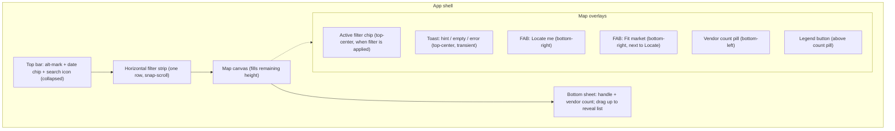
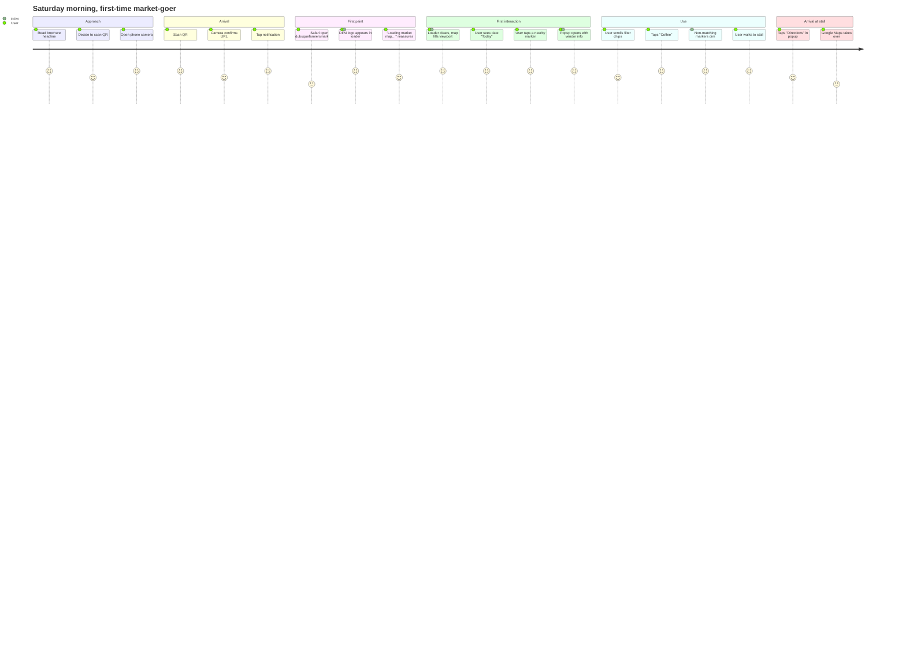

# Interactive Map — Art Direction & UX/UI Spec

**Status:** Phase 1 — draft for review
**Scope:** [`src/public/vendor-map-full-ui.html`](../src/public/vendor-map-full-ui.html) (the Leaflet iframe users see when they scan the brochure QR code). The Velo shell [`src/pages/MAP.mggqp.js`](../src/pages/MAP.mggqp.js) is a pass-through data layer and is out of scope here.
**Audience:** Designers + implementers. Read alongside [`docs/MAP_GUIDE.md`](MAP_GUIDE.md) (architecture & deployment).
**North star:** *A first-time user lands from a brochure QR code, and within three seconds knows they are at the Dubuque Farmers' Market, which market day they are looking at, where they are standing, and how to find what they came for.*

---

## Table of contents

1. [Brand foundations](#1-brand-foundations)
2. [Art direction](#2-art-direction)
3. [Information architecture](#3-information-architecture-mobile-first)
4. [Annotated wireframes](#4-annotated-wireframes)
5. [Component inventory & states](#5-component-inventory--states)
6. [Motion & micro-interactions](#6-motion--micro-interactions)
7. [Accessibility](#7-accessibility)
8. [Copy voice guide](#8-copy-voice-guide)
9. [Empty, error, loading, and offline states](#9-empty-error-loading-and-offline-states)
10. [QR-scan journey](#10-qr-scan-journey)
11. [Design token contract](#11-design-token-contract)

---

## 1. Brand foundations

### 1.1 Palette

Five canonical brand colors plus three surface neutrals. **No other hues may be used in chrome, markers, or popups.** (The Leaflet basemap is intentionally exempt — it renders its own desaturated tile colors.)

| Token | Hex | Role | WCAG notes |
|-------|-----|------|------------|
| `--dfm-teal` | `#1E5C4E` | Ink. Primary text color. Popup header background. Active filter pill. Brand lockup on white. | AA on `--surface-cream` (9.9:1), AA on `--dfm-white` (9.3:1). |
| `--dfm-green` | `#3EB449` | Primary action / confirmation / "you are here" trail. Farm-fresh marker. | AA Large on white (3.3:1). **Do not use for body text on white.** Safe as button fill with white label. |
| `--dfm-gold` | `#EBAE1E` | Accent / selected-state ring / featured vendor / loading. Ready-to-eat marker. | AA Large on teal (7.9:1). **Do not use as body text on white.** |
| `--dfm-gold-light` | `#FDCB22` | Subtle gold highlight (hover glow, texture overlay). | Decorative only. |
| `--dfm-muted` | `#759287` | Sage support. POI markers, secondary copy, empty-stall pin. | AA on white (4.5:1). Body-text-safe. |
| `--surface-cream` | `#FAF8F5` | Default app surface. Map wrapper background behind tiles. | — |
| `--surface-sand` | `#E8E4DC` | Muted warm surface. Stall outlines, dividers, toast backdrops. | — |
| `--surface-mist` | `#F0F0ED` | Quiet surface. Search input bed, secondary button fill. | — |
| `--ink-black` | `#1A1A1A` | Deep ink for high-density text on gold. Rare. | — |
| `--white` | `#FFFFFF` | Clean surface. Popup body, card fills. | — |

**Rogue colors to remove** (currently in [`vendor-map-full-ui.html`](../src/public/vendor-map-full-ui.html) `:root`): `--terracotta #9c6644`, `--berry #8b3a62`, `--rust #bf5f3f`, `--moss #7a9b6d`. These don't appear in the 2025 brand kit. Phase 2 replaces every usage:

- Filter chip "food" active state: terracotta → `--dfm-gold` (accent is the right read for *ready to eat*).
- Filter chip "artisan" active state: berry → `--dfm-teal` (chrome/ink is the right read for *crafters*).
- "Occasional vendors" marker: moss → `--dfm-muted`.
- "Clear all" hover: rust → `--dfm-teal`.
- User-location marker: hardcoded `#2196F3` → `--dfm-teal` core + `--dfm-gold-light` pulsing halo (keeps user dot visually distinct from vendor greens without breaking palette).

### 1.2 Typography

Three type faces, four usages. Milkbar and Dreamboat-Thin currently ship in [`src/public/fonts/`](../src/public/fonts/) but are **not wired up to any rule** — spec locks in where each one lives.

| Face | Files (already in repo) | Use | Max size | Never |
|------|-------------------------|-----|----------|-------|
| **TAY Milkbar** | `TAYMilkbar.otf` | Hero wordmark when we draw it in HTML (fallback if we can't use the PNG logo). Popup-header vendor names. Bottom-sheet title. | 28px mobile / 34px tablet+ | As body text. As button label. Anything under 20px. |
| **TAY Dreamboat-Thin** | `TAYDreamboat-Thin.otf` | Poster-y accents — "Today at the market" over the date chip, stall-block labels in popups, "Featured" ribbon text. | 18px mobile / 22px tablet+ | As UI chrome. Anywhere it must read in under 0.5 seconds (it's a display face, it's decorative). |
| **Poppins** | Google Fonts (400, 500, 600, 700) | All body copy, button labels, filter chips, toasts, search input, date selector, popup descriptions, tag chips. | N/A (covers 11-22px) | — |
| *Outdoors Inks, TAY Dreamboat (bold)* | Loaded but **not used in the map** | Reserved for other surfaces in the brand kit. Removed from iframe CSS in Phase 2 to stay under the Wix CLI sync size budget. | — | — |

**Type scale (mobile-first; +2px at ≥480px unless noted):**

| Role | Face / weight | Mobile | Tablet+ | Tracking | Line height |
|------|---------------|--------|---------|----------|-------------|
| Hero wordmark (HTML fallback) | Milkbar | 28px | 34px | 0 | 1.0 |
| Popup title | Milkbar | 20px | 22px | +0.01em | 1.2 |
| Bottom-sheet title | Milkbar | 22px | 24px | 0 | 1.2 |
| Overline ("Today at the market") | Dreamboat-Thin | 14px | 16px | +0.04em | 1.1 |
| Featured ribbon | Dreamboat-Thin | 13px | 14px | +0.05em | 1.0 |
| H2 (legend, filter tray title) | Poppins 600 | 16px | 17px | 0 | 1.3 |
| Body (popup description, tooltips) | Poppins 400 | 14px | 15px | 0 | 1.55 |
| UI label (buttons, chips, date selector, search) | Poppins 600 | 13px | 14px | +0.01em | 1.2 |
| Micro (tags, vendor count, "1 of 12") | Poppins 500 | 12px | 12px | +0.02em | 1.25 |
| Marker number (stall pill) | Poppins 700 | 9px | 9px | +0.02em | 1.0 |

**Fallback stacks** (loaded fonts are already `display: swap`):

- Milkbar → `"TAY Milkbar", "Fraunces", Georgia, serif`
- Dreamboat-Thin → `"TAY Dreamboat Thin", "Caveat", "Shadows Into Light", cursive`
- Poppins → `"Poppins", -apple-system, BlinkMacSystemFont, "Segoe UI", Roboto, sans-serif`

### 1.3 Textures

The brand kit ships four textures. Textures are **atmosphere, not texture-for-the-sake-of-texture** — every usage must carry meaning and must never obscure a marker or reduce legibility of copy.

| Texture | Planned file | Where it lives in the map | Blend mode / opacity |
|---------|--------------|---------------------------|----------------------|
| Canvas-Pebble | `textures/DFM-Texture_Canvas-Pebble.png` | Controls panel background (behind brand mark + date + search), at 6% opacity over `--surface-cream`. | `multiply`, 6% |
| Canvas-Earthy | `textures/DFM-Texture_Canvas-Earthy.png` | Bottom-sheet handle region (drag handle + vendor-count bar), at 10% opacity over `--surface-sand`. | `multiply`, 10% |
| Screenprint-Earthy | `textures/DFM-Texture_Screenprint-Earthy.png` | Popup header band behind vendor title, at 18% opacity over `--dfm-teal`. Gives the popup header a poster-stock feel. | `overlay`, 18% |
| Screenprint-White | `textures/DFM-Texture_Screenprint-White.png` | "Featured vendor" ribbon, at 30% opacity over `--dfm-gold`. | `overlay`, 30% |

**Hard rules:**

- Textures never appear over the map canvas itself (would conflict with tile imagery).
- Textures never appear behind body copy smaller than 14px.
- If a texture PNG fails to load, the solid-color fallback must remain fully legible (all the stated opacities keep underlying contrast intact).
- Textures are served as optimized PNGs (≤ 40KB each, 1024px long edge) from [`src/public/textures/`](../src/public/textures/). They are not referenced in any other surface from the iframe.

### 1.4 Logos & marks

Eight marks you provided (horizontal lockup full-color + inverse, primary/stacked full-color + inverse, two alt-marks `DBQ FMRS MRKT` + `Fresh Local Goods` rosette, `Iowa's Oldest Open-Air Market` arch, `Fresh Local Goods` inverse rosette). Only the horizontal full-color lockup (`dfm-logo-horizontal.png`) is currently in [`src/public/`](../src/public/). Phase 2 adds the rest to `src/public/brand/` for use in the iframe.

**Lockup rules for the map:**

| Viewport | Mark | Location | Height |
|----------|------|----------|--------|
| ≥ 640px (tablet / desktop) | Horizontal lockup (full-color) | Controls-panel top-left, linked to `/` | 44px |
| 420–640px | Horizontal lockup (full-color) | Controls-panel top-left | 36px |
| 320–420px | Alt-mark `DBQ FMRS MRKT` box (green) | Controls-panel top-left | 36px (square) |
| Popup header (vendor detail) | Alt-mark `DBQ FMRS MRKT` (inverse, white) | Right-aligned at 14px, inside the Screenprint-Earthy band | 18px |
| Loading overlay | Primary stacked full-color | Center, above spinner | 80px |
| Empty-state vendor list | `Iowa's Oldest Open-Air Market` arch | Center, above copy | 120px |

**Never:**

- The primary stacked lockup inside the header bar (too tall; breaks the one-line layout).
- Any mark on a non-brand color background.
- Resizing below 28px tall (legibility breaks).
- The `Fresh Local Goods` rosette as a favicon-style anchor — it's a seal, not a button.

### 1.5 Tone of voice

The DFM is a 170-year-old Iowa institution run by neighbors. The map is the polite, practical, slightly wry friend who is walking you through it. Voice rules:

- **Imperative, not descriptive.** "Find a vendor" > "You can find a vendor here."
- **Short. One-beat labels.** "Locate me" > "Find my location on the map."
- **Warm, never corporate.** "Seat's warm, vendor TBA" > "Vendor to be announced."
- **First-person plural for market ops.** "We're updating stall assignments." Not "The market staff are updating…"
- **No exclamation points** except in the one "welcome" toast. Markets are busy; exclamations in error states make things feel worse.
- **No jargon.** "SNAP / EBT" is fine (it's the name of the program). "DUFB" is fine if spelled out on first use. "Geolocation permission denied" is not fine — say "We can't see your location. Did you allow the map to use it?"
- **Iowa, not Texas.** Avoid "y'all" and "howdy." Lean on weekend-morning warmth.

Examples collected in [§8 Copy voice guide](#8-copy-voice-guide).

---

## 2. Art direction

### 2.1 The "brand-on-a-map" moment

Most map UIs feel like a cartographer's tool. This one should feel like a **paper brochure you unfolded at the entrance** — warm, hand-set, a little bit screen-printed, with clear wayfinding. The map tiles are the ground; the brand is the ink on top.

**Visual principles:**

1. **Ink over image.** Base tiles are desaturated (Carto Voyager or Positron). Vendor markers are the only saturated color on screen.
2. **Two brand greens, one gold.** Teal is chrome/authority (headers, active state, ink). Green is action/go/farm-fresh. Gold is attention/accent/featured. Never use gold and green side-by-side on the same element at the same weight — one must be the fill and the other the ring/accent.
3. **Warm surfaces.** White is reserved for the popup card interior. App chrome is cream or sand with a whisper of canvas texture. Prevents the "clinical" feel that default Leaflet has.
4. **Rounded but not cutesy.** Corner radius uses 6 / 12 / 20 / pill. Never 4, never 16, never 24 — keeps the system disciplined.
5. **Shadows as elevation, not drama.** Three shadow depths (`sm`, `md`, `lg`). All tinted with `rgba(30, 92, 78, *)` (teal) so they feel like the brand, not a black drop.

### 2.2 Marker style

Current markers are generic colored circles with Font Awesome glyphs. Phase 2 keeps the circle-with-icon DNA (it reads well at small sizes) but rebrands it:

| Tier | Shape | Size | Fill | Stroke | Icon |
|------|-------|------|------|--------|------|
| Vendor — default | Circle | 36px | Category color (see below) | 2.5px white | FA glyph, 14px, white |
| Vendor — focused (popup open) | Circle | 44px (scale 1.22) | Same as default | 2.5px white + 4px `--dfm-gold-light` halo | Same |
| Vendor — dimmed (another popup open) | Circle | 36px | Same, 35% opacity | 2.5px white, 35% | Same |
| Vendor — featured | Circle | 38px | Category color | 3px `--dfm-gold` ring | FA glyph + tiny gold star in ne corner |
| Empty stall | Rounded square | 24px | `--dfm-muted` at 70% | 2px white | Stall ID in Poppins 700, 9px, white |
| POI — default | Hexagon (new) | 30px | POI color | 2px white | FA glyph, 13px, white |
| User location | Circle + halo | 16px core / 44px halo | `--dfm-teal` core | 3px white | — (halo pulses `--dfm-gold-light`) |

**Vendor category → marker fill:**

| Category | Color token | Why |
|----------|-------------|-----|
| Grower / Producer / Processor | `--dfm-green` | Growing = green. Primary action color makes farm-fresh the hero. |
| On-site Prepared Food | `--dfm-gold` | Warmest color, reads as "eat me now." |
| Crafter / Artisan | `--dfm-teal` | Maker depth / ink. |
| Occasional Vendor | `--dfm-muted` | Literal "supporting role" color. |
| Default / uncategorized | `--dfm-muted` | Fallback. |

**POI category → marker fill:**

| POI | Color | Icon |
|-----|-------|------|
| Information | `--dfm-teal` | `fa-circle-info` |
| Restroom | `--dfm-teal` | `fa-restroom` |
| Seating | `--dfm-muted` | `fa-chair` |
| Public Parking | `--dfm-gold` | `fa-square-parking` |
| Vendor Parking | `--dfm-muted` | `fa-square-parking` |
| Market Tokens | `--dfm-gold` | `fa-coins` |
| Special Event | `--dfm-teal` + gold ring | `fa-star` |
| Market Merchandise | `--dfm-green` | `fa-bag-shopping` |

The existing [`POI_CONFIG`](../src/public/vendor-map-full-ui.html) object at roughly line 1391 already carries these — Phase 2 maps those hardcoded hex values onto the token set above so there is one source of truth.

### 2.3 Stall polygon treatment

Currently stalls render as `#d4c4a0` on `#b8a88a` — a beige that conflicts with the warm surfaces. Phase 2:

- **Unassigned stall polygon:** `fill: --surface-sand` at 35% opacity, `stroke: --dfm-muted` at 60% opacity, 1px.
- **Assigned stall polygon:** same fill, but `stroke: --dfm-teal` at 80% opacity. (Assignment visually "claims" the stall.)
- **Focused stall polygon** (popup open on its vendor): `fill: --dfm-gold-light` at 25% opacity, `stroke: --dfm-gold` at 100%, 2px.
- **Tooltip on polygon hover** (desktop only): stall ID in Poppins 700 on `--dfm-teal` pill, 12px, anchored at polygon center.

### 2.4 Basemap

Current basemap: Carto `light_all`. Spec confirms it's the right choice — desaturated, minimal labels, warm gray streets. **Phase 2 keeps `light_all`** but adds a subtle `filter: saturate(0.9) contrast(1.05)` on the tile layer to nudge it a half-step toward our cream surface. Keeps attribution (© OpenStreetMap, © CartoDB) as required.

### 2.5 Moodboard (one-line references)

- **Paper brochure, folded in a jacket pocket** — soft, warm, already loved-in.
- **Risograph-printed festival poster** — limited palette, texture, a little misregistered in spirit.
- **1960s USDA pamphlet** — civic, confident, not trying to look like a SaaS app.

---

## 3. Information architecture (mobile-first)

Seventy percent of traffic will land via the brochure QR code on an unknown phone in bright outdoor sunlight. The layout is designed first for a 360×740 viewport with the phone held vertically; everything above that is a progressive enhancement.

### 3.1 Zones (mobile, 320–640px)



**Height budget on a 360×740 viewport (portrait phone):**

- Top bar: 56px
- Filter strip: 48px
- Map canvas: 740 − 56 − 48 − 64 (safe area bottom) = **572px** minimum
- Bottom sheet (collapsed): anchored to the map's bottom edge; shows the vendor-count pill + filter chip count + a 24px drag handle. Does not reduce map canvas height when collapsed because it overlays.

### 3.2 Progressive enhancement at ≥ 640px

Same zones, different rhythm:

- Top bar gains the horizontal logo lockup (44px) and the search input expands inline (no longer hidden behind an icon).
- Filter strip becomes a single row with no snap-scroll (all filters fit on one line on common desktops).
- Legend is a persistent panel docked to the bottom-left, not a modal.
- Bottom sheet becomes a collapsible left-side drawer (`320px` wide, closeable).

### 3.3 Progressive enhancement at ≥ 1024px

- Two-column: left drawer (320px vendor list, always open) + map.
- Popups become side-panel cards instead of Leaflet tooltips (no map occlusion).

### 3.4 What lives where, and why

| Zone | Rationale |
|------|-----------|
| **Alt-mark (top-left)** | Brand recognition inside 1 second. Links to `/`. Alt-mark `DBQ FMRS MRKT` at 36×36 on mobile keeps it compact but legible — the horizontal lockup would waste 220px of header width. |
| **Date chip (top-center)** | Second most important answer — "what day is this?" Dropdown instead of a full calendar because 90% of visits want "today" or "next market day." |
| **Search icon → expands (top-right)** | Mobile keyboards push UI around; keeping search collapsed until needed preserves map real estate. On desktop it's always-expanded. |
| **Filter strip (below top bar)** | Discoverable without reading. Horizontally scrollable with fade-out edges (current implementation is good; we keep it). |
| **Active filter chip (above map)** | Reassurance — "you are filtered to Coffee." Dismissible. |
| **Map canvas (hero)** | 70%+ of the viewport. Everything else is in service of this. |
| **FABs: Locate + Fit market (bottom-right)** | Thumb zone. Separated by 58px gap because they do very different things — "am I here" vs "show me the whole market." |
| **Vendor count pill (bottom-left)** | Passive, confirms "there are 23 vendors today." Taps open the bottom sheet full list. |
| **Legend button (above count pill)** | One-tap access, rarely needed, but critical for first-timers. |
| **Bottom sheet (anchored bottom)** | The hidden hero. Drag up or tap the count pill to reveal a scrollable vendor list — the keyboard- and screen-reader-accessible entry point to the same data the markers expose. |

### 3.5 What is *not* on screen

We deliberately leave off:

- A sidebar "menu." The map is one view with one purpose.
- A login button. This is a public map; auth belongs on the Wix site shell surrounding the iframe.
- Ads, sponsor logos, social-share buttons. The map exists to serve market-goers on market day.
- A "download the app" banner. There is no app. Don't imply one.

---

## 4. Annotated wireframes

Drawn at 360×740 (portrait phone) unless noted. Dimensions are logical pixels. Legend for the ASCII frames below:

```
┃ ┃   = vertical edges of the viewport
━━━   = horizontal zone dividers
░░░   = Leaflet map tiles (you're seeing streets / parking lots)
▒▒▒   = Canvas-Pebble texture at 6% (barely visible, but there)
████  = a filled element (color called out in the annotation)
[ · ] = an interactive control
(↕)   = drag handle
```

### 4.1 QR-landing — data loaded (happy path)

The 3-second test. First paint after the QR scan.

```
┏━━━━━━━━━━━━━━━━━━━━━━━━━━━━━━━━━━━━┓
┃ ▒▒▒▒▒▒▒▒▒▒▒▒▒▒▒▒▒▒▒▒▒▒▒▒▒▒▒▒▒▒▒▒▒▒ ┃  ┐
┃ ▒ [DBQ] [ Sat, May 2 ▾ ]      [🔍] ┃  │  56px top bar
┃ ▒▒▒▒▒▒▒▒▒▒▒▒▒▒▒▒▒▒▒▒▒▒▒▒▒▒▒▒▒▒▒▒▒▒ ┃  ┘
┃ [ 🍴 Eat ][ 🥕 Farm ][ 🍰 Baked ]▸  ┃  ─── 48px filter strip (snap-scroll)
┃ ░░░░░░░░░░░░░░░░░░░░░░░░░░░░░░░░░░ ┃  ┐
┃ ░░░░░░░ 23 vendors today ░░░░░░░░░ ┃  │  ← pill, bottom-left (tap = open sheet)
┃ ░░░░░░ ● ░░░░░░ ● ░░░░ ● ░░░░░░░░░ ┃  │
┃ ░░░░░░░░░░ ● ░░░░░ ● ░░░░░░░░ ● ░░ ┃  │  572px map canvas
┃ ░░░░░░░░░░░░░ [+/-] ░░░░░░░░░░░░░░ ┃  │  (Leaflet zoom ctrl, bottom-left)
┃ ░░░░░░░░░░░░░░░░░░░░░░░░ (?)  [◉] ┃  │  ← legend btn + locate FAB
┃ ░░░░░░░░░░░░░░░░░░░░░░░░ [⊞]      ┃  │  ← fit-market FAB (left of locate)
┃ ━━━━━━━━━━━━━━━(↕)━━━━━━━━━━━━━━━━ ┃  ┘  ← bottom-sheet handle strip, 24px
┗━━━━━━━━━━━━━━━━━━━━━━━━━━━━━━━━━━━━┛
```

**Annotations:**

| # | Element | State | Notes |
|---|---------|-------|-------|
| 1 | Top bar | `--surface-cream` with Canvas-Pebble texture at 6% | `border-bottom: 1px solid --surface-sand` |
| 2 | `DBQ FMRS MRKT` alt-mark | 36×36, full-color | `<a href="/">` wrapping the img, accessible name "Dubuque Farmers' Market home" |
| 3 | Date chip | Pill, `--dfm-teal` fill, white Poppins 600 14px | Chevron down, 32px high. Label "Today" replaces the date on the *next-upcoming* market day. |
| 4 | Search icon (collapsed) | 44×44 tap target, `--dfm-muted` glyph | Taps expand to an inline input pushing the date chip off-screen left. |
| 5 | Filter strip | One row, snap-scroll, fade-out edges | Chips: see §5.4. |
| 6 | Vendor count pill | White surface, `--dfm-green` number, Poppins 600 | Whole pill is a button — taps open the bottom sheet. |
| 7 | Legend button | 44×44 white circle, `--dfm-teal` `fa-circle-question` | Tap opens the legend overlay. |
| 8 | Fit-market FAB | 52×52 white circle, `--dfm-teal` `fa-map-location-dot` | Hidden until map has bounds. |
| 9 | Locate FAB | 52×52 white circle, `--dfm-teal` `fa-location-crosshairs` | Primary action. 12px gap to the right edge. |
| 10 | Bottom sheet handle | 24px strip, Canvas-Earthy texture at 10% over `--surface-sand`, drag handle 40×4 `--dfm-muted` at 50% | Drag up → sheet fills 70% of viewport. |

### 4.2 QR-landing — still loading (first paint)

Before `loadMapData` arrives. The critical "I'm alive, don't leave" moment.

```
┏━━━━━━━━━━━━━━━━━━━━━━━━━━━━━━━━━━━━┓
┃ ▒ [DBQ] [░░░░░░░░░░░░]       [🔍] ┃  ← date chip skeleton
┃ [░░░░░][░░░░░][░░░░░][░░░░░] ▸    ┃  ← chip skeletons (4 of them)
┃                                    ┃
┃          ┌──────────────┐          ┃
┃          │              │          ┃
┃          │   [ DFM      │          ┃  ← primary stacked lockup, 80px tall
┃          │    logo ]    │          ┃
┃          │              │          ┃
┃          └──────────────┘          ┃
┃                                    ┃
┃                ◍ ◌ ◌                ┃  ← 3-dot pulse, 8px, --dfm-gold
┃        Loading market map…         ┃  ← Poppins 500 14px --dfm-teal
┃                                    ┃
┗━━━━━━━━━━━━━━━━━━━━━━━━━━━━━━━━━━━━┛
```

Replaces the current full-screen spinner. The logo is the brand recognition moment; the 3-dot pulse is the "we're working" signal (gentler than a spinning ring, matches brand warmth).

### 4.3 Vendor popup open

Tapped a marker. The marker scales to 1.22 with a gold halo; the focused popup dominates the map.

```
┏━━━━━━━━━━━━━━━━━━━━━━━━━━━━━━━━━━━━┓
┃ ▒ [DBQ] [ Sat, May 2 ▾ ]      [🔍] ┃
┃ [ 🍴 Eat ][ 🥕 Farm ][ 🍰 Baked ]▸  ┃
┃ ░░░░░░░░░░░░░░░░░░░░░░░░░░░░░░░░░░ ┃
┃ ░░ ┌──────────────────────────────┐ ┃  ← popup wrapper, 300px wide
┃ ░░ │ ██████████████████████  [×] │ ┃  ← header, --dfm-teal + Screenprint-Earthy
┃ ░░ │ ██ Bluffside Bakery       ██ │ ┃  ← Milkbar 20px, white
┃ ░░ │ ██ Stall B3–B4            ██ │ ┃  ← Dreamboat-Thin 14px, white @ 90%
┃ ░░ │ ██ [DBQ]                  ██ │ ┃  ← alt-mark 18px, inverse, top-right
┃ ░░ │──────────────────────────────│ ┃
┃ ░░ │ Sourdough, focaccia, bagels. │ ┃  ← Poppins 400 14px --ink-black
┃ ░░ │ Saturday drop arrives 7am.   │ ┃
┃ ░░ │                              │ ┃
┃ ░░ │  [▣ sourdough] [▣ focaccia]  │ ┃  ← tag chips, --surface-mist
┃ ░░ │──────────────────────────────│ ┃
┃ ░░ │  [ Directions ]  [ Website ] │ ┃  ← primary / secondary buttons, 44px
┃ ░░ │      ◀ 3 of 23    ▶          │ ┃  ← prev / next navigation
┃ ░░ └──────────────────────────────┘ ┃
┃ ░░░░░░░ ● ░░░░ ● ░░░░ ● (dimmed) ░░ ┃
┃ ━━━━━━━━━━━━━━━(↕)━━━━━━━━━━━━━━━━ ┃
┗━━━━━━━━━━━━━━━━━━━━━━━━━━━━━━━━━━━━┛
```

**Annotations:**

- Popup header uses `--dfm-teal` with Screenprint-Earthy texture at 18% `overlay`.
- Alt-mark (inverse) sits inside the header band to ground the popup in brand.
- Close button: 30×30, `rgba(0,0,0,0.15)` backdrop, white glyph — persistent regardless of header texture (no more runtime contrast computation).
- Primary button "Directions" is the farm-green (`--dfm-green`) opening maps at the stall centroid. Secondary "Website" is ghost with `--dfm-teal` border.
- Previous / next popup navigation: 6 o'clock of the card, Poppins 500 12px `--dfm-muted`.
- Other vendor markers are dimmed to 35% to center attention.

Stall with no vendor shows a simplified version of this popup: header title "Stall B7", subtitle "Seat's warm, vendor TBA," body empty, no action buttons.

### 4.4 Bottom sheet expanded (vendor list)

Dragged up or opened by tapping the vendor count pill. Covers 70% of viewport.

```
┏━━━━━━━━━━━━━━━━━━━━━━━━━━━━━━━━━━━━┓
┃ ▒ [DBQ] [ Sat, May 2 ▾ ]      [🔍] ┃
┃ [ 🍴 Eat ][ 🥕 Farm ][ 🍰 Baked ]▸  ┃
┃ ░░░░░░░░░░░░░░░░░░░░░░░░░░░░░░░░░░ ┃  ← 30% map peek, still interactive
┃ ░░░░░░░░░░░░░░░░░░░░░░░░░░░░░░░░░░ ┃
┃━━━━━━━━━━━━━━━━(↕)━━━━━━━━━━━━━━━ ┃  ← sheet handle
┃ Today at the market                 ┃  ← Dreamboat-Thin 16px --dfm-teal
┃ 23 vendors • 6 places of interest   ┃  ← Poppins 500 13px --dfm-muted
┃────────────────────────────────────┃
┃ ● Bluffside Bakery      Stall B3–4 ┃  ┐
┃   Sourdough, focaccia, bagels       ┃  │  row, 64px tall, tappable
┃────────────────────────────────────┃  │
┃ ● Copper Kettle         Stall A12  ┃  │
┃   Seasonal preserves, salsa        ┃  │
┃────────────────────────────────────┃  │
┃ ● Prairie Bloom Farm    Stall C2   ┃  │  ← scrollable
┃   Flowers, herbs, microgreens      ┃  │
┃────────────────────────────────────┃  │
┃        … scroll for more           ┃  ┘
┗━━━━━━━━━━━━━━━━━━━━━━━━━━━━━━━━━━━━┛
```

- Category-colored dot on each row = vendor marker color.
- Tapping a row pans the map to that marker and opens its popup; the sheet collapses to the handle. Respects `prefers-reduced-motion`.
- This list is also the screen-reader "vendor list" surface — see §7.3.
- If a filter is active, the sheet header shows "4 of 23 vendors match 'Coffee'" and a "Clear filter" link.

### 4.5 Filter tray with active filter

Coffee filter tapped. Map dims vendors that don't match, active-filter chip appears at top-center.

```
┏━━━━━━━━━━━━━━━━━━━━━━━━━━━━━━━━━━━━┓
┃ ▒ [DBQ] [ Sat, May 2 ▾ ]      [🔍] ┃
┃ [ 🍴 Eat ][ 🥕 Farm ][███ Coffee ]▸ ┃  ← active chip: --dfm-gold fill, ink text
┃ ░░   ┌──────────────────────┐  ░░ ┃  ┐ active-filter chip (toast)
┃ ░░   │ ☕ Coffee & Tea  [×] │  ░░ ┃  │  --dfm-teal, white text, 34px high
┃ ░░   └──────────────────────┘  ░░ ┃  ┘  top-center, shadow-lg
┃ ░░░░░░ ● (coffee) ░░░░░░░░░░░░░░░░ ┃  ← matching markers at full opacity
┃ ░░░░░░░ ◌ (dimmed) ░░ ◌ (dimmed) ░ ┃  ← non-matching at 35%
┃ ░░░░░░░░░░░░░░░░░░░░░░░░░░░░░░░░░░ ┃
┃ ░░░░░░░░ 4 of 23 ░░░░░░░░░░ (?) [◉]┃
┃ ━━━━━━━━━━━━━━━(↕)━━━━━━━━━━━━━━━━ ┃
┗━━━━━━━━━━━━━━━━━━━━━━━━━━━━━━━━━━━━┛
```

- Active-filter toast is a short pill (8px vertical padding, 16px horizontal) with the chosen category icon + label + `×` close.
- Tap `×` or any other filter chip to clear.
- Vendor count pill updates: "4 of 23".
- If zero match: vendor count reads "0 of 23" in `--dfm-gold`, and a map-message toast says "No Coffee vendors today. [ Clear filter ]".

### 4.6 Locate me — denied

User tapped Locate; browser / Wix returned `locationError`. No current visual for this state in the live map.

```
┏━━━━━━━━━━━━━━━━━━━━━━━━━━━━━━━━━━━━┓
┃ ▒ [DBQ] [ Sat, May 2 ▾ ]      [🔍] ┃
┃ [ 🍴 Eat ][ 🥕 Farm ][ 🍰 Baked ]▸  ┃
┃ ░░ ┌──────────────────────────────┐ ┃
┃ ░░ │ We can't see your location.  │ ┃  ← top-center toast, --dfm-teal
┃ ░░ │ Check the map permission in  │ ┃    Poppins 500 14px white
┃ ░░ │ your phone settings.   [Try  │ ┃
┃ ░░ │ again]                       │ ┃
┃ ░░ └──────────────────────────────┘ ┃
┃ ░░░░░░░░░░░░░░░░░░░░░░░░░░░░░░░░░░ ┃
┃ ░░░░░░░░░░░░░░░░░░░░░░░░░░░░░░░░░░ ┃
┃ ░░░░░░░░ 23 vendors ░░░░░░░░(?) [◉]┃  ← locate FAB: --dfm-gold-light ring
┃ ━━━━━━━━━━━━━━━(↕)━━━━━━━━━━━━━━━━ ┃         (disabled visual, still tappable)
┗━━━━━━━━━━━━━━━━━━━━━━━━━━━━━━━━━━━━┛
```

- Toast stays for 6 seconds or until dismissed (tap anywhere outside).
- Locate FAB gets a `denied` state: white fill, `--dfm-gold-light` 3px ring, `fa-location-slash` glyph in `--dfm-muted`.
- Tapping again re-triggers the permission flow (no harm in retrying — Wix may have cached a denial but users can re-enable in settings and try once more).

---

## 5. Component inventory & states

One row per UI atom. States are: **idle / hover / focus-visible / active / loading / disabled / error / empty**. Not every state applies to every component; "—" means N/A. Tap-target floor is 44×44 per WCAG 2.5.5 Target Size.

### 5.1 Top bar

| State | Visual |
|-------|--------|
| Default | `--surface-cream` bg + Canvas-Pebble 6%, `1px solid --surface-sand` bottom border, `shadow-sm` |

No state variants (it's static chrome). The components inside it have states.

### 5.2 Brand mark (alt-mark `DBQ FMRS MRKT`)

| State | Visual |
|-------|--------|
| Idle | Full-color PNG, 36×36, `border-radius: 6px` |
| Focus-visible | 3px `--dfm-gold` outline, 2px offset |
| Active (tap) | Opacity 0.7 for 120ms |

Accessible name: `"Dubuque Farmers' Market home"`. Links to `/`.

### 5.3 Date chip

| State | Visual |
|-------|--------|
| Idle | Pill, `--dfm-teal` fill, white Poppins 600 14px, chevron-down glyph right, `shadow-sm`, 44×32 minimum, horizontal padding 12/20 |
| Hover (desktop) | Brightness +8% |
| Focus-visible | 3px `--dfm-gold` outline, 2px offset |
| Loading | Text replaced with 4×16 skeleton pill |
| Open (select dropdown shown) | Native `<select>` — OS draws the options list; no custom dropdown |
| Today | Dot badge: 6×6 `--dfm-gold` circle before the date text |

Text rule: if the selected date is today's date, label reads "Today"; if it's the next upcoming market Saturday, label reads "Next market: Sat, May 2"; otherwise "Sat, May 2, 2026".

### 5.4 Filter chip

| State | Visual |
|-------|--------|
| Idle | White fill, 2px `--dfm-muted` border, `--ink-black` Poppins 500 13px, icon 14px, pill, 44×44 min |
| Hover (desktop) | `--surface-mist` fill, `--dfm-teal` border, translate `y: -1px` |
| Focus-visible | 3px `--dfm-gold` outline, 2px offset |
| Active (pressed, on-the-way-down) | `scale(0.98)`, 80ms |
| Selected | Category-specific fill (see §2.2), white text + icon, `shadow-md` |
| Selected + focus-visible | Same as selected + 3px `--dfm-gold` outline |
| Disabled (zero matches today) | Fill `--surface-mist`, text `--dfm-muted`, `opacity: 0.5`, cursor not-allowed |

"Clear All" chip variant: transparent fill, `2px dashed --dfm-muted` border. Hover → solid border + `--dfm-teal`.

Full chip list (with matching rule and icon):

| Label | Rule | Matcher | Selected color |
|-------|------|---------|----------------|
| Eat | vendorType | `On-site Prepared Food Vendor` | `--dfm-gold` |
| Farm | vendorType | `Grower/Producer/Processor` | `--dfm-green` |
| Baked | keyword | `bakery bread cookie pie cake sweet pastry` | `--dfm-gold` |
| Coffee | keyword | `coffee espresso latte tea chai` | `--dfm-gold` |
| SNAP / EBT | keyword | `snap ebt dufb double up food bucks` | `--dfm-teal` |
| Info | poiType | `Information` | `--dfm-teal` |
| Restroom | poiType | `Restroom` | `--dfm-teal` |
| Seating | poiType | `SeatingArea` | `--dfm-muted` |
| Parking | poiType | `PublicParkingArea` | `--dfm-gold` |
| Tokens | poiType | `Market Tokens` | `--dfm-gold` |
| Clear | (reset) | — | (ghost) |

### 5.5 Search input

| State | Visual |
|-------|--------|
| Collapsed (mobile) | 44×44 icon button only, `--dfm-muted` glyph on transparent |
| Expanded / idle | Pill, `--surface-mist` fill, 2px `--dfm-muted` border, Poppins 400 14px, placeholder `--dfm-muted`, leading 🔍 icon, 40px left padding |
| Focus-visible | `--surface-cream` fill, 2px `--dfm-teal` border, 3px `--dfm-gold` outline |
| Has value | Trailing × clear button appears |
| Clear button | 36×36 circle, `--dfm-muted` bg, white × glyph. Hover: `--dfm-teal` bg |

Search is debounced 300ms. Enter key blurs input. Taps outside collapse back to icon on mobile.

### 5.6 Active filter toast chip

| State | Visual |
|-------|--------|
| Visible | Pill, `--dfm-teal` fill, white Poppins 600 13px, leading category icon, trailing × button (22×22 circle, `rgba(255,255,255,0.25)`), 34px tall, `shadow-md`, top-center with 8px gap below the filter strip |
| Enter animation | Slide down 12px + fade-in 180ms |
| Exit animation | Fade-out 120ms |

### 5.7 Vendor marker

| State | Visual |
|-------|--------|
| Idle | 36×36 circle, category fill, 2.5px white border, `shadow-sm`, FA glyph 14px white |
| Focused (popup open) | `scale(1.22)`, + 4px `--dfm-gold-light` halo, `shadow-md` |
| Dimmed (other popup open) | `opacity: 0.35` |
| Featured | Same as idle + 3px `--dfm-gold` ring outside the white border, plus a 10×10 gold star in top-right |
| Hover (desktop) | `scale(1.12)` |

### 5.8 Empty-stall marker

| State | Visual |
|-------|--------|
| Idle | 24×24 rounded-square, `--dfm-muted` fill at 70%, 2px white border, stall ID in Poppins 700 9px white, centered |
| Hover (desktop) | Opacity 1.0, `shadow-sm` |
| Popup open on this stall | Same as idle (no focus state — it's a passive marker) |

### 5.9 POI marker

| State | Visual |
|-------|--------|
| Idle | 30×30 hexagon (new), POI category fill, 2px white border, FA glyph 13px white |
| Focused | `scale(1.15)`, `shadow-md` |
| Dimmed | `opacity: 0.35` |

(Hexagon chosen to visually distinguish POIs from vendor circles at a glance on a crowded map.)

### 5.10 Stall polygon

Already described in §2.3. No hover state on touch.

### 5.11 Popup

| Element | Idle | Focus-visible |
|---------|------|---------------|
| Wrapper | White bg, `radius-md`, `shadow: 0 8px 30px rgba(0,0,0,0.18)` | — |
| Header | `--dfm-teal` + Screenprint-Earthy 18% overlay, 14/16 padding | — |
| Title | Milkbar 20px white, `letter-spacing: 0.01em`, max 2 lines with ellipsis | — |
| Subtitle (stall ID) | Dreamboat-Thin 14px white at 90% opacity | — |
| Alt-mark (inverse) | `DBQ FMRS MRKT` 18×18 top-right, 14px from edges | — |
| Close button | 30×30 circle, `rgba(0,0,0,0.15)` bg, white × glyph | 3px `--dfm-gold` outline |
| Body | 12/16 padding, Poppins 400 14px `--ink-black`, line-height 1.55 | — |
| Tags wrapper | 6px gap, wrap | — |
| Tag chip | 4/10 padding, `--surface-mist` fill, 4px left border `--dfm-muted`, Poppins 500 13px `--ink-black` | — |
| Primary button | `--dfm-green` fill, white Poppins 700 13px, 10/14 padding, `radius-sm`, 44px min-height, leading icon | 3px `--dfm-gold` outline |
| Secondary button | `--surface-mist` fill, `--ink-black` text, 1px `--surface-sand` border + 3px `--dfm-muted` left border | 3px `--dfm-gold` outline |
| Prev/Next nav | Ghost button, 6/10 padding, Poppins 500 13px `--dfm-teal`, 1px `--surface-sand` border, `radius-sm` | 3px `--dfm-gold` outline |
| Nav count | Poppins 500 12px `--dfm-muted` | — |

Empty-stall popup variant: no body, no buttons, no nav; just header with title "Stall B7" and subtitle "Seat's warm, vendor TBA" in Dreamboat-Thin.

### 5.12 Locate FAB

| State | Visual |
|-------|--------|
| Idle | 52×52 white circle, `--dfm-teal` `fa-location-crosshairs` glyph 18px, `shadow-lg` |
| Hover (desktop) | `scale(1.05)`, `--surface-mist` bg |
| Focus-visible | 3px `--dfm-gold` outline |
| Active (pressed) | `scale(0.95)` |
| Locating | `--dfm-green` glyph, 1.5s pulse `opacity: 1 ↔ 0.5` |
| Active (location shown) | `--dfm-green` fill, white glyph, `shadow-lg` |
| Denied | White fill, 3px `--dfm-gold-light` ring, `fa-location-slash` in `--dfm-muted` |

### 5.13 Fit-market FAB

| State | Visual |
|-------|--------|
| Hidden | `display: none` (no bounds yet) |
| Idle | Same geometry as Locate FAB, `--dfm-teal` `fa-map-location-dot` glyph |
| Hover / focus / active | Mirror the Locate FAB states |

Positioned 58px to the left of Locate FAB on tablet+; mobile shifts both down 12px from the 24px bottom to avoid the sheet handle.

### 5.14 Vendor count pill

| State | Visual |
|-------|--------|
| Idle | White surface pill, 8/16 padding, Poppins 600 13px `--ink-black`, count number in `--dfm-green`, `shadow-md`, 1px `--surface-sand` border, `radius-md` |
| Filtered | Count is "4 of 23", number in `--dfm-gold` |
| Empty (0 vendors) | Text "No vendors today", `--dfm-muted` |
| Hover (desktop) | `--surface-mist` bg |
| Focus-visible | 3px `--dfm-gold` outline |

Whole pill is a button — activation opens the bottom sheet full list.

### 5.15 Legend button + overlay

Legend button: 44×44 white circle, `--dfm-teal` `fa-circle-question`, `shadow-lg`. Same state model as FABs.

Legend overlay (when open):

| Element | Visual |
|---------|--------|
| Wrapper | White, `radius-md`, `shadow-lg`, 14/16 padding, min-width 200px, `--surface-sand` 1px border |
| Title ("Map legend") | Dreamboat-Thin 16px `--dfm-teal`, bottom-margin 10px |
| Section heading ("Vendor types") | Poppins 600 13px `--dfm-teal`, uppercase, letter-spacing +0.04em |
| Legend row | 10px gap, 14×14 category dot (colored circle, 2px white border, 1px `rgba(0,0,0,0.12)` ring), Poppins 500 13px `--ink-black` |

### 5.16 Toast / map-message

| State | Visual |
|-------|--------|
| Hidden | `opacity: 0; pointer-events: none` |
| Visible (info) | `--dfm-teal` pill, white Poppins 500 14px, 8/16 padding, `shadow-lg`, top-center, auto-dismiss 5s |
| Visible (error) | Same geometry, `--dfm-teal` fill, white text, leading ⚠ glyph in `--dfm-gold-light`, auto-dismiss 6s |
| Inline action ("Clear filter") | Ghost pill inside toast: Poppins 600 12px white, `rgba(255,255,255,0.25)` bg, 1px `rgba(255,255,255,0.5)` border |

### 5.17 Bottom sheet

| State | Visual |
|-------|--------|
| Collapsed (default) | 48px tall strip anchored to viewport bottom, Canvas-Earthy 10% over `--surface-sand`, 40×4 `--dfm-muted` drag handle, vendor-count summary to the right |
| Dragged | Translates upward with pointer; no snap until 30% / 70% / 95% thresholds |
| Expanded (70% vh) | List fills the sheet, max 5 visible rows before scroll |
| Fully expanded (95% vh) | Large-keyboard mode; date chip + search + filters remain at top |
| Closing | 200ms ease-out translate |

### 5.18 Vendor list row (inside bottom sheet)

| State | Visual |
|-------|--------|
| Idle | 64px tall, 14/16 padding, `--surface-cream` bg, 1px `--surface-sand` bottom border, 12×12 category dot, vendor name Poppins 600 15px `--ink-black`, stall ID Poppins 500 12px `--dfm-muted` right-aligned, description Poppins 400 13px `--dfm-muted` single-line truncated |
| Hover (desktop) / tapped | `--surface-mist` bg |
| Focus-visible | 3px `--dfm-gold` inset outline |
| Highlighted (matches current filter) | Leading dot scaled 1.2 with `--dfm-gold-light` halo |

### 5.19 Design preview watermark (preview mode only)

| State | Visual |
|-------|--------|
| Visible | Bottom-right badge, 14px from edges, `--dfm-gold` fill, `--ink-black` Poppins 700 11px, label "DESIGN PREVIEW", leading `fa-flask` glyph, 4/10 padding, `radius-pill`, `shadow-md`. Dismissible × (12px) |
| Dismissed | Hidden until next page load |

Only renders when `?designPreview=1` is present.

### 5.20 Design preview toolbar (preview mode only)

| State | Visual |
|-------|--------|
| Visible | Top-right slim bar below the top bar, `--ink-black` bg at 90% opacity, white Poppins 500 12px, 4px padding, pill buttons for each state (`empty`, `loading`, `error`, `offline`, `locdenied`, `longtext`), one active at a time (active = `--dfm-gold` fill, `--ink-black` text) |
| Collapsed | 20×20 `fa-gear` icon button in the top-right watermark region |

Accessible via keyboard (tab to each state button). Only renders when `?designPreview=1&devtoolbar=1` is present; default is the minimal watermark.

---

## 6. Motion & micro-interactions

Motion should feel like **paper being moved on a table**, not like pixels sliding across a screen. Short, subtle, weighted.

### 6.1 Easing & duration tokens

| Token | Curve | Feel |
|-------|-------|------|
| `--ease-standard` | `cubic-bezier(0.4, 0, 0.2, 1)` | Default; most transitions |
| `--ease-entrance` | `cubic-bezier(0.0, 0.0, 0.2, 1)` | Things arriving on screen |
| `--ease-exit` | `cubic-bezier(0.4, 0.0, 1, 1)` | Things leaving |
| `--ease-pop` | `cubic-bezier(0.34, 1.56, 0.64, 1)` | Marker focus; ever-so-slight overshoot |
| `--motion-fast` | 120ms | Taps, button presses, clear buttons |
| `--motion-base` | 200ms | Chip toggles, hover, search expand |
| `--motion-slow` | 350ms | Map fly-to, popup auto-pan |
| `--motion-slower` | 500ms | Bottom sheet drag settle |

### 6.2 Specific interactions

| Interaction | Movement | Duration | Easing |
|-------------|----------|----------|--------|
| Filter chip toggle on | `scale(0.98) → 1` | 120ms | `--ease-pop` |
| Filter chip toggle off | Border color + fill cross-fade | 200ms | `--ease-standard` |
| Active-filter toast enter | `translateY(-12px → 0)` + fade-in | 180ms | `--ease-entrance` |
| Active-filter toast exit | Fade-out only | 120ms | `--ease-exit` |
| Marker scale-on-focus | `scale(1 → 1.22)` + halo opacity `0 → 1` | 200ms | `--ease-pop` |
| Marker dim on other-focus | `opacity: 1 → 0.35` | 200ms | `--ease-standard` |
| Popup open | Leaflet default + our overlay fade-in of close button | 250ms | `--ease-entrance` |
| Map fly-to-selected | `map.setView(..., { duration: 0.35 })` | 350ms | Leaflet default cubic |
| Bottom sheet drag release | Snap to nearest threshold | 320ms | `--ease-standard` |
| Legend overlay open | Fade + scale from 0.96 to 1 | 180ms | `--ease-entrance` |
| Loading 3-dot pulse | Opacity `0.3 ↔ 1` staggered 150ms | 900ms loop | linear |
| Locate FAB "locating" | Pulse `opacity: 1 ↔ 0.5` on the glyph | 1500ms loop | linear |
| User-location halo | Scale `1 → 1.4` + opacity `0.6 → 0` | 1800ms loop | `--ease-entrance` |

### 6.3 Reduced motion

When `(prefers-reduced-motion: reduce)` matches, every animated interaction above is replaced with an **instant state change**:

- Transitions: `transition: none !important` on a scoped `.respects-motion-pref *` class.
- `map.setView` / `map.panTo` / `map.fitBounds` pass `animate: false`.
- Marker scale changes apply without the transform transition (visually the marker just "is" bigger).
- Toast enter/exit becomes a pure opacity toggle, no translate.
- Loading pulse is replaced with a static 3-dot row (no opacity animation). The text "Loading market map…" becomes the progress signal.
- Bottom sheet drag still works (dragging itself isn't an animation), but its release-snap is instant.
- User-location halo is static at 1.2× scale and 40% opacity.

This spec honors the existing [`prefersReducedMotion()`](../src/public/vendor-map-full-ui.html) helper. Phase 2 extends it to the new animations.

### 6.4 No-motion zones

Some things **never animate**, reduced-motion setting notwithstanding, because animating them harms the task:

- Marker icon swap when a vendor's category changes (would be weird).
- Filter-match state on existing markers (instant hide/show is clearer than fade).
- Date selector dropdown (native OS control — we don't style the opening).
- Leaflet zoom level text ("+ / −" buttons).

### 6.5 Haptics

On iOS Safari, the `window.navigator.vibrate` API is unavailable and Haptic Engine is gated. We don't invoke it. Marker taps produce no haptic feedback.

---

## 7. Accessibility

Target: **WCAG 2.2 Level AA** with the known exception that Leaflet's map canvas is not keyboard-navigable to individual markers by default. We compensate with the bottom-sheet vendor list (§7.3), which is the keyboard + screen-reader entry point.

### 7.1 Semantic structure

The iframe is treated as a self-contained mini-app. Landmark roles from top to bottom:

```html
<header role="banner">          <!-- Top bar -->
<nav role="navigation" aria-label="Map filters">  <!-- Filter strip -->
<main role="main" aria-label="Market map">
  <div role="application" aria-label="Interactive market map (press Tab to open the vendor list)"> <!-- Leaflet wrapper -->
  <aside role="complementary" aria-label="Vendor list">  <!-- Bottom sheet -->
</main>
<div role="status" aria-live="polite" aria-atomic="true"> <!-- Toast / map-message -->
```

- **Skip link** at the very top (visually hidden until focused): "Skip map, jump to vendor list" — moves focus into the bottom sheet's list.
- `<h1>` (visually hidden) reads "Dubuque Farmers' Market — interactive map" so screen readers announce the iframe's purpose.

### 7.2 Keyboard order

Tab order flows left-to-right, top-to-bottom:

1. Skip-to-list link (visually hidden, becomes visible on focus)
2. Brand mark link
3. Date chip
4. Search input (if expanded) or search toggle (if collapsed)
5. Each filter chip, left-to-right, one tabstop per chip
6. Clear-all chip (last chip)
7. Leaflet map wrapper (`role="application"`, receives focus but then swallows arrow keys)
8. Fit-market FAB
9. Locate FAB
10. Legend button
11. Legend overlay rows (when open)
12. Vendor count pill (opens the bottom sheet)
13. Bottom sheet handle (when sheet is closed)
14. Bottom sheet content: date-chip mirror + search mirror + filter chips again + vendor list rows + action buttons per row (when sheet is expanded)

### 7.3 Screen-reader vendor list (the critical a11y surface)

Leaflet markers are notoriously poor with screen readers — each marker is a positioned `<div>` with no inherent meaning. Our solution:

The bottom sheet's vendor list is the **parallel content surface**. Every marker visible on the map has a corresponding `<li>` in the list. The list carries:

- `role="list"` on the wrapper (explicit because `<ul>` can be hijacked by Leaflet CSS)
- Each `<li role="listitem">` contains:
  - `<button>` with accessible name `"Bluffside Bakery, stall B3 through B4, sourdough focaccia bagels"` (category dot is `aria-hidden="true"`)
  - Activating the button fires the same marker.openPopup() flow, plus moves focus into the popup dialog
- Filter state changes update the list synchronously; SR users hear a `role="status"` announcement: "4 vendors match Coffee."
- Date change triggers a polite `aria-live` announcement: "Showing 23 vendors for Saturday May 2."

### 7.4 Popup as a dialog

When a popup opens:

- Popup root has `role="dialog"` and `aria-modal="false"` (the map remains visible and interactive; this is a non-modal dialog).
- Popup gets `aria-labelledby` pointing to the vendor title `<div>` and `aria-describedby` pointing to the description.
- Focus moves to the close button on open (not to the title, because users on keyboard expect an obvious escape).
- Escape key closes the popup and returns focus to the originating marker's list-button in the bottom sheet (map-focused popup flow).
- Tab cycles within the popup (close → directions → website → prev → next → close), trapping focus until Escape is pressed.

### 7.5 Contrast audit

Every palette pair used in Phase 2, measured against WCAG 2.2:

| Foreground | Background | Ratio | Pass? | Usage |
|------------|------------|-------|-------|-------|
| `--dfm-teal` | `--surface-cream` | 9.9:1 | AAA | Body text default |
| `--dfm-teal` | `--white` | 9.3:1 | AAA | Popup title |
| White | `--dfm-teal` | 9.3:1 | AAA | Popup header text |
| White | `--dfm-green` | 3.3:1 | AA Large only | Primary button label — label is 13px/700 so passes Large |
| `--ink-black` | `--dfm-gold` | 11.1:1 | AAA | Watermark text; "Today" badge |
| White | `--dfm-gold` | 1.9:1 | **FAIL** | Never use white on gold |
| `--dfm-muted` | `--white` | 4.5:1 | AA | Secondary copy |
| `--dfm-muted` | `--surface-mist` | 4.4:1 | AA (just) | Placeholder text — ensure ≥14px |
| White | `--dfm-muted` | 4.5:1 | AA | Marker icon on POI marker |
| `--dfm-teal` | `--surface-mist` | 9.1:1 | AAA | Secondary button text |
| `--dfm-gold` | `--dfm-teal` | 7.9:1 | AAA | Accent marks on teal backgrounds (star, featured ring) |

**Hard rule:** body-weight text below 14px must hit 4.5:1 against its background. The table above is the only authoritative source.

### 7.6 Focus visibility

All interactive elements share one focus ring style: **3px `--dfm-gold` outline, 2px offset, no outline-radius** — matches across buttons, chips, inputs, FABs, list rows, and the map wrapper. The ring renders on `:focus-visible` only (not on every click). The existing rule at roughly line 846 of [`vendor-map-full-ui.html`](../src/public/vendor-map-full-ui.html) is retained and extended to cover the new components.

### 7.7 Touch target sizing

- All interactive elements are 44×44 minimum.
- Filter chips have 10/16 padding giving 44px min-height; horizontal padding varies but never below 44px hit-area overall.
- The bottom sheet drag handle's hit area is inflated to 44px tall (the visible 4px handle sits inside a transparent 44px strip).
- Empty-stall markers (24×24) are a known exception — they're informational, not actionable, and they carry no click handler beyond the Leaflet popup (which has its own 30×30 close button). Visually they're paired with a larger hit area via `icon-anchor` tuning and the Leaflet default click radius.

### 7.8 Localization & text expansion

English-only at launch. Spec ensures every label can grow 30% without layout breakage:

- Filter chips use `white-space: nowrap` and overflow horizontally (snap-scroll absorbs extra length).
- Popup titles use 2-line clamp with ellipsis fallback.
- Date chip has a minimum width but no maximum; on narrow screens the label truncates with a right-side fade.
- Vendor list rows have 1-line truncation on description, 2-line on title.

### 7.9 Motion preference respect

Already specified in §6.3. In addition:

- No auto-playing content.
- No parallax.
- No "attention-grabbing" animations lasting longer than 5 seconds.
- The welcome toast ("Tap any pin for vendor details") auto-dismisses in 5 seconds — acceptable under WCAG 2.2.2 because it's a static message that doesn't move.

### 7.10 Known-limitation disclosures

The map is implemented on top of Leaflet, which does not support keyboard marker navigation out of the box. We mitigate this with the bottom-sheet vendor list. We explicitly mark this in the [`docs/MAP_GUIDE.md`](MAP_GUIDE.md) "Known limitations" section (Phase 2 adds the note).

For users with severe motor impairments, the map is still navigable via the list — markers are a preview / visualization, and every action available at a marker is also available in the sheet (open details, get directions, see website).

---

## 8. Copy voice guide

Exact strings for every labeled surface. **Copy is a design asset** — implementers must paste these verbatim; they have been tuned for tone, length, and screen-reader clarity.

### 8.1 Top bar

| Surface | String |
|---------|--------|
| Brand mark accessible name | `Dubuque Farmers' Market home` |
| Date chip — today's date is a market day | `Today` |
| Date chip — next upcoming market Saturday | `Next market: Sat, May 2` |
| Date chip — any other selected date | `Sat, May 2, 2026` |
| Date chip accessible name | `Select market date` |
| Search toggle accessible name | `Search vendors` |
| Search input placeholder | `Search vendors…` |
| Search input accessible name | `Search vendors by name or product` |
| Search clear accessible name | `Clear search` |

### 8.2 Filter chips

| Chip | Label | Accessible name (if different) |
|------|-------|-------------------------------|
| Eat | `Eat` | `Filter: ready-to-eat food vendors` |
| Farm | `Farm` | `Filter: farm-fresh growers` |
| Baked | `Baked` | `Filter: baked goods` |
| Coffee | `Coffee` | `Filter: coffee and tea` |
| SNAP / EBT | `SNAP / EBT` | `Filter: vendors that accept SNAP or EBT` |
| Info | `Info` | `Filter: information points` |
| Restroom | `Restroom` | `Filter: restrooms` |
| Seating | `Seating` | `Filter: seating areas` |
| Parking | `Parking` | `Filter: public parking` |
| Tokens | `Tokens` | `Filter: market token booth` |
| Clear | `Clear` | `Clear all filters` |

### 8.3 Map overlays

| Surface | String |
|---------|--------|
| Loading overlay | `Loading market map…` |
| First-time hint toast (shown once per browser) | `Tap any pin for vendor details. Swipe filters to explore.` |
| Vendor count (default) | `23 vendors today` |
| Vendor count (singular) | `1 vendor today` |
| Vendor count (zero today) | `No vendors today` |
| Vendor count (filtered) | `4 of 23 vendors` |
| Active filter chip (Coffee example) | `Coffee & Tea` (icon leading) |
| Active filter chip clear accessible name | `Clear active filter` |
| No-match toast | `No Coffee vendors today.` (with `Clear filter` inline action) |
| Legend button accessible name | `Show map legend` |
| Legend title | `Map legend` |
| Legend sub-heading | `Vendor types` / `Places of interest` |
| Fit-market FAB accessible name | `Fit map to market area` |
| Locate FAB accessible name | `Find my location on the map` |
| Locate FAB denied accessible name | `Location unavailable. Tap to try again.` |

### 8.4 Popup

| Surface | String |
|---------|--------|
| Empty-stall title | `Stall B7` |
| Empty-stall subtitle | `Seat's warm, vendor TBA` |
| Vendor popup subtitle — single stall | `Stall B3` |
| Vendor popup subtitle — contiguous block | `Stalls B3–B4` |
| Vendor popup subtitle — non-contiguous | `Stalls B3 and B7` |
| Primary button | `Directions` |
| Secondary button | `Website` |
| Previous nav button | `Previous` |
| Next nav button | `Next` |
| Nav count | `3 of 23` |
| Popup close accessible name | `Close vendor details` |
| Featured ribbon | `Featured` |
| SNAP badge | `SNAP / EBT accepted` |
| Description fallback (vendor has no description) | `A friendly face at the Dubuque Farmers' Market.` |

### 8.5 Bottom sheet

| Surface | String |
|---------|--------|
| Sheet handle accessible name | `Open vendor list` (collapsed) / `Close vendor list` (expanded) |
| Sheet heading overline | `Today at the market` |
| Sheet summary (default) | `23 vendors • 6 places of interest` |
| Sheet summary (filtered) | `4 vendors match Coffee` |
| Clear filter link (in sheet) | `Clear filter` |
| Empty sheet (date has no vendors) | `No vendors are scheduled for this date. Check another Saturday, or come by — we might still be setting up.` |
| Row accessible name format | `{vendorName}, {stallLabel}, {truncatedDescription}` |

### 8.6 Error & edge-case messages

| Surface | String |
|---------|--------|
| Data fetch failure | `We couldn't load the market today. Pull down to refresh, or try again in a moment.` |
| Tile-load failure (offline) | `Map tiles are slow to load. Check your connection.` |
| Location denied | `We can't see your location. Check the map permission in your phone settings.` |
| Location timeout | `Finding your location is taking a while. Tap the crosshair again to retry.` |
| Location outside market area | `You're a few blocks from the market. Follow Iowa Street toward the square.` |
| Date data empty (CMS returned no vendors for that date) | `No vendors are scheduled for Sat, May 9. The next market is Sat, May 16.` |
| Stall with no assigned vendor | `Seat's warm, vendor TBA` |
| Vendor with no description | `A friendly face at the Dubuque Farmers' Market.` |
| Iframe cut off by Wix Editor preview | `If this map looks cut off, try the full site.` |

### 8.7 Voice do's and don'ts

| ✅ Do | ❌ Don't |
|-------|----------|
| "Seat's warm, vendor TBA" | "Vendor to be announced at a later date" |
| "No Coffee vendors today." | "Your search returned no results." |
| "We can't see your location." | "Geolocation permission denied." |
| "Today at the market" | "Current Market Inventory" |
| "Find my location" | "Geolocate me" |
| "Directions" | "Get driving directions" |
| "Tap any pin for vendor details." | "Please click a pin to view vendor information." |

### 8.8 Alt text for images

- `dfm-logo-horizontal.png` → alt `""` when used as decorative brand mark wrapped in an `<a>` that already has an aria-label. Alt `"Dubuque Farmers' Market"` when standalone.
- Vendor-supplied photos (future enhancement) → alt pulled from CMS; default `"{Vendor name} at the market"`.
- Textures → `alt=""`, `role="presentation"`. They're purely decorative.

---

## 9. Empty, error, loading, and offline states

One matrix per screen, so Phase 2 implementation can't miss one.

### 9.1 Initial load (before first `loadMapData`)

| Condition | State |
|-----------|-------|
| Happy | Loading overlay (§4.2) with stacked logo + 3-dot pulse + "Loading market map…" |
| Loading > 3s | Same visual; add secondary text `This is taking a moment…` under the first string |
| Loading > 10s | Replace with error state: `We couldn't reach the market today. Check your connection and try again.` + a `Try again` button that sends a fresh `iframeReady` message |
| `mapDataError` message received | Toast overlay as described in §9.3 |

### 9.2 Empty states

| Scenario | Copy | Visual |
|----------|------|--------|
| No vendors on selected date | `No vendors are scheduled for Sat, May 9.` + `The next market is Sat, May 16.` | Centered in sheet area, arch mark `Iowa's Oldest Open-Air Market` above; date-chip stays active; map still shows stall outlines |
| Filter matches zero vendors | `No Coffee vendors today.` | Toast top-center + vendor count pill reads `0 of 23` in `--dfm-gold` |
| Search matches zero vendors | `No vendors match "bread".` | Toast + count pill |
| All filters cleared | (no message) | Default state |
| No market dates in CMS at all | `Market dates haven't been announced yet. Check back soon!` | Date chip replaced with inline message; map fills viewport with welcome-mat lockup |

### 9.3 Error states

| Trigger | Visual | Copy | Recovery |
|---------|--------|------|----------|
| `mapDataError` | Top-center toast, `--dfm-teal` bg, ⚠ in `--dfm-gold-light` | `We couldn't load the market today. Try again in a moment.` | Toast auto-dismisses 6s; map remains interactable with cached data if available |
| Location timeout | Top-center toast | `Finding your location is taking a while. Tap the crosshair to retry.` | Locate FAB returns to idle |
| Location denied | Top-center toast + FAB denied state | `We can't see your location. Check the map permission in your phone settings.` | Toast 6s; FAB stays in denied state until next tap |
| Tile load failure (offline) | Subtle overlay at map corner (not modal) | `Map tiles are slow to load. Check your connection.` | Overlay disappears as tiles come in |
| Iframe message from wrong origin | (silently dropped, logged to console in dev) | — | No user-visible state |

### 9.4 Loading skeletons (per component)

| Component | Loading skeleton |
|-----------|------------------|
| Date chip | 100×32 pill, `--surface-sand → mist → sand` shimmer |
| Filter chip | 80×44 pill, same shimmer |
| Vendor count pill | 120×32 pill, same shimmer |
| Popup body (data pending) | 3 lines of `--surface-mist` rectangles |
| Bottom sheet rows | 5 rows of 64px each, each with a 12×12 dot placeholder + 2 lines of text |

Skeleton rule: never show a skeleton for longer than 8 seconds. After 8s swap to the "Loading > 10s" recovery message from §9.1.

### 9.5 Offline / flaky connection

The iframe has no service worker. Offline handling is best-effort:

- If the tile CDN is unreachable, Leaflet shows its default gray squares; we add a subtle overlay (§9.3).
- If a `loadMapData` was previously received and cached in-memory, stale data remains usable (markers stay rendered). Date switches will fail with the error toast from §9.3.
- There is no persistent offline mode. The map is a real-time tool; stale cached data would be worse than telling the user "try again."

Future enhancement (backlog): lightweight service worker caching the last-viewed date's vendor list + the 3 most-recent Carto tiles. Not in scope for Phase 2.

### 9.6 Slow 3G budget

On a simulated slow 3G connection:

| Moment | Target |
|--------|--------|
| Iframe HTML parsed | ≤ 2.5s |
| Brand mark visible (first paint) | ≤ 3.0s |
| Loading overlay visible with "Loading market map…" | ≤ 3.2s |
| First tiles + first marker rendered | ≤ 8.0s |
| Full market data ready | ≤ 12.0s |

These are the numbers the performance checklist in [`docs/TESTING.md`](TESTING.md) will validate before each publish.

---

## 10. QR-scan journey

End-to-end walkthrough from a user approaching the brochure outside Town Clock Plaza on a Saturday morning.

### 10.1 Journey map



### 10.2 Detailed timing (happy path)

| Step | Action | Elapsed | Feedback |
|------|--------|---------|----------|
| 0 | User scans QR | 0s | Camera confirms link |
| 1 | Browser opens URL | ~1.5s | Safari loading bar |
| 2 | Wix shell paints | ~2.5s | Site header visible |
| 3 | Iframe HTML parsed | ~3s | Blank cream canvas |
| 4 | Loader renders | ~3.2s | DFM stacked logo + "Loading market map…" |
| 5 | `iframeReady` → Velo responds with dates + data | ~4.5s | Loader remains |
| 6 | Map tiles begin to paint | ~5s | Gray → cream → street grid |
| 7 | Markers render | ~5.5s | All vendor + POI markers visible |
| 8 | Loader dismisses | ~5.8s | Welcome toast appears: "Tap any pin for vendor details." |
| 9 | User taps a pin | ~8s+ | Marker focuses, popup opens, map pans |

### 10.3 Branching paths

**Path: User scans at home the night before.**
- They're not on-site. Locate FAB would show them pinned on a neighborhood 2 miles from Town Clock.
- Copy adaptation: no change (we don't know their intent, and "You're a few blocks from the market" is actionable either way).

**Path: User scans during off-hours (Wednesday evening).**
- Date chip defaults to the *next* market Saturday. Label reads "Next market: Sat, May 9".
- Map shows stall outlines but no vendors (empty state §9.2).
- Copy: "No vendors today. The next market is Sat, May 9" — with a subtle reassurance that the stalls aren't empty, they're just *paused*.

**Path: User scans, denies location, then tries to use Locate.**
- See §9.3. FAB goes to denied state; toast shown.
- No hard block — the rest of the map works fine.

**Path: User scans from a brochure at a partner business 2 miles away.**
- Locate puts them 2 miles away, still shows the DFM map.
- Works as-is; no "would you like driving directions to the market" prompt (too aggressive).

### 10.4 Post-visit (bonus)

- If the user returns later the same day, the map re-opens to Today with the last viewed zoom/center (handled by `localStorage.dfm_map_view`).
- The welcome toast does not re-fire (flagged via `localStorage.dfm_map_hint_shown`).
- Filter state and search state are NOT persisted across sessions — we do not want a user to open the map next Saturday and find it still filtered to "Coffee" from three months ago.

### 10.5 Success criteria for Phase 2 sign-off

After Phase 2 ships, the QR journey has succeeded when:

1. On a first-time cold load on a simulated 3G iOS Safari, the brand mark is visible within 3s.
2. The date chip label is correct (Today / Next market: … / specific date) on every loading path.
3. A first-time user can locate one vendor by name within 15 seconds.
4. A first-time user can filter to "Coffee" and find a matching stall within 20 seconds.
5. A screen-reader user can hear the vendor list and activate a vendor within 30 seconds.
6. No WCAG 2.2 AA violations in automated (`axe-core`) audits, across all six wireframed states.
7. Zero console errors during the first 60 seconds of interaction.

---

## 11. Design token contract

This is the exhaustive list of CSS custom properties Phase 2 must define (and only these). Any value not here is a design drift and must be reviewed. The existing [`vendor-map-full-ui.html`](../src/public/vendor-map-full-ui.html) `:root` block contains some of these already under different names — Phase 2 renames and consolidates.

All tokens live in `:root {}` inside the `<style>` block of the iframe.

### 11.1 Color

| Token | Value | Notes |
|-------|-------|-------|
| `--dfm-teal` | `#1E5C4E` | Ink. Never substitute. |
| `--dfm-green` | `#3EB449` | Action. |
| `--dfm-gold` | `#EBAE1E` | Accent. |
| `--dfm-gold-light` | `#FDCB22` | Accent soft. |
| `--dfm-muted` | `#759287` | Support. |
| `--ink-black` | `#1A1A1A` | Rare, for text on gold. |
| `--white` | `#FFFFFF` | Popup body, card fills. |
| `--surface-cream` | `#FAF8F5` | Default app surface. |
| `--surface-sand` | `#E8E4DC` | Muted warm surface. |
| `--surface-mist` | `#F0F0ED` | Quiet surface. |

### 11.2 Semantic color mappings

Derived from §11.1. Phase 2 components reference these, not the raw palette tokens. This keeps one layer of indirection so future theme changes don't rewrite every component rule.

| Token | Maps to | Used by |
|-------|---------|---------|
| `--color-ink` | `--dfm-teal` | Body text default |
| `--color-ink-muted` | `--dfm-muted` | Secondary copy |
| `--color-ink-strong` | `--ink-black` | Text on gold |
| `--color-surface-app` | `--surface-cream` | Top bar, map wrapper |
| `--color-surface-raised` | `--white` | Popup body, cards |
| `--color-surface-quiet` | `--surface-mist` | Search input, secondary button |
| `--color-surface-rail` | `--surface-sand` | Bottom-sheet handle, stall polygons |
| `--color-action-primary` | `--dfm-green` | Primary buttons, "Directions" |
| `--color-action-primary-hover` | `color-mix(in srgb, var(--dfm-green) 88%, var(--dfm-teal))` | Hover state |
| `--color-chrome` | `--dfm-teal` | Popup header, active filter |
| `--color-accent` | `--dfm-gold` | Selected ring, featured, focus outline |
| `--color-accent-soft` | `--dfm-gold-light` | Halo, location pulse |
| `--color-divider` | `--surface-sand` | 1px borders |
| `--color-border` | `color-mix(in srgb, var(--dfm-muted) 50%, transparent)` | Chip borders at rest |
| `--color-border-strong` | `--dfm-teal` | Chip borders on hover |
| `--marker-vendor-farm` | `--dfm-green` | Farm-fresh markers |
| `--marker-vendor-eat` | `--dfm-gold` | Ready-to-eat markers |
| `--marker-vendor-craft` | `--dfm-teal` | Crafter markers |
| `--marker-vendor-occasional` | `--dfm-muted` | Occasional markers |
| `--marker-vendor-default` | `--dfm-muted` | Fallback |
| `--marker-poi-info` | `--dfm-teal` | Info / Restroom / Seating-event POI |
| `--marker-poi-amenity` | `--dfm-muted` | Seating, Vendor Parking |
| `--marker-poi-utility` | `--dfm-gold` | Parking, Tokens |
| `--marker-poi-event` | `--dfm-teal` | Special Event |
| `--marker-poi-merch` | `--dfm-green` | Merchandise |
| `--marker-user-core` | `--dfm-teal` | User location dot |
| `--marker-user-halo` | `--dfm-gold-light` | User pulsing halo |
| `--marker-empty-stall` | `--dfm-muted` | Unassigned stall pill |

### 11.3 Typography

| Token | Value |
|-------|-------|
| `--font-display-serif` | `"TAY Milkbar", "Fraunces", Georgia, serif` |
| `--font-display-script` | `"TAY Dreamboat Thin", "Caveat", "Shadows Into Light", cursive` |
| `--font-body` | `"Poppins", -apple-system, BlinkMacSystemFont, "Segoe UI", Roboto, sans-serif` |
| `--font-mono` | `ui-monospace, "SF Mono", Consolas, monospace` (reserved for future; not used today) |
| `--fs-hero` | `clamp(1.75rem, 1.2rem + 2vw, 2.125rem)` (28px → 34px) |
| `--fs-popup-title` | `clamp(1.25rem, 1.1rem + 0.4vw, 1.375rem)` |
| `--fs-sheet-title` | `clamp(1.375rem, 1.2rem + 0.5vw, 1.5rem)` |
| `--fs-overline` | `clamp(0.875rem, 0.8rem + 0.2vw, 1rem)` |
| `--fs-h2` | `clamp(1rem, 0.95rem + 0.2vw, 1.0625rem)` |
| `--fs-body` | `clamp(0.875rem, 0.85rem + 0.1vw, 0.9375rem)` |
| `--fs-ui` | `clamp(0.8125rem, 0.8rem + 0.1vw, 0.875rem)` |
| `--fs-micro` | `0.75rem` |
| `--fs-stall` | `0.5625rem` |
| `--fw-regular` | `400` |
| `--fw-medium` | `500` |
| `--fw-semibold` | `600` |
| `--fw-bold` | `700` |
| `--lh-tight` | `1.2` |
| `--lh-body` | `1.55` |
| `--lh-ui` | `1.25` |
| `--ls-overline` | `0.04em` |
| `--ls-ui` | `0.01em` |

### 11.4 Spacing

4-based scale. Multiply these; don't hardcode pixels.

| Token | Value | Typical use |
|-------|-------|-------------|
| `--space-3xs` | `2px` | Inner padding on tight labels |
| `--space-2xs` | `4px` | Icon-to-label gap |
| `--space-xs` | `6px` | Tag padding vertical |
| `--space-sm` | `8px` | Chip padding vertical |
| `--space-md` | `12px` | Popup body padding; top-bar gap |
| `--space-lg` | `16px` | Default padding |
| `--space-xl` | `24px` | Section separator |
| `--space-2xl` | `32px` | Dialog margin from viewport edge |
| `--space-3xl` | `48px` | Vertical rhythm between major sections |

### 11.5 Radius

| Token | Value | Use |
|-------|-------|-----|
| `--radius-none` | `0` | Polygons, tiles |
| `--radius-sm` | `6px` | Tag chips, buttons inside popup, brand mark |
| `--radius-md` | `12px` | Cards, legend overlay, popup wrapper, map controls |
| `--radius-lg` | `20px` | Bottom-sheet top corners |
| `--radius-pill` | `999px` | Filter chips, active-filter chip, date chip, toasts, search input, vendor count pill |

### 11.6 Shadow (elevation)

All shadows tinted with teal, not neutral black — keeps the brand feel consistent.

| Token | Value | Use |
|-------|-------|-----|
| `--shadow-sm` | `0 1px 2px rgba(30, 92, 78, 0.06), 0 1px 3px rgba(30, 92, 78, 0.04)` | Top bar border; chip rest |
| `--shadow-md` | `0 2px 4px rgba(30, 92, 78, 0.07), 0 4px 8px rgba(30, 92, 78, 0.05)` | Selected chips, vendor count pill |
| `--shadow-lg` | `0 4px 8px rgba(30, 92, 78, 0.08), 0 8px 24px rgba(30, 92, 78, 0.1)` | FABs, legend overlay, popup |
| `--shadow-glow` | `0 0 0 3px rgba(235, 174, 30, 0.35)` | Focus glow on search |
| `--shadow-popup` | `0 8px 30px rgba(30, 92, 78, 0.15)` | Popup-specific, larger drop |

### 11.7 Motion

| Token | Value |
|-------|-------|
| `--motion-fast` | `120ms` |
| `--motion-base` | `200ms` |
| `--motion-slow` | `350ms` |
| `--motion-slower` | `500ms` |
| `--ease-standard` | `cubic-bezier(0.4, 0, 0.2, 1)` |
| `--ease-entrance` | `cubic-bezier(0.0, 0.0, 0.2, 1)` |
| `--ease-exit` | `cubic-bezier(0.4, 0.0, 1, 1)` |
| `--ease-pop` | `cubic-bezier(0.34, 1.56, 0.64, 1)` |

### 11.8 Z-index

| Token | Value | Use |
|-------|-------|-----|
| `--z-map` | `1` | Leaflet canvas |
| `--z-overlay` | `1000` | Map overlays (FAB, count pill, legend button) |
| `--z-overlay-raised` | `1001` | Active filter chip, toast |
| `--z-sheet` | `1500` | Bottom sheet |
| `--z-loader` | `2000` | Loading overlay |
| `--z-watermark` | `2500` | Design preview watermark (above everything) |
| `--z-popup` | `1000` | Leaflet popup (matches its default; documented for conflict awareness) |

### 11.9 Layout breakpoints

| Token | Value | Layout |
|-------|-------|--------|
| `--bp-compact` | `320px` | Narrowest supported |
| `--bp-mobile` | `480px` | Up-scale type, expand search |
| `--bp-tablet` | `640px` | Horizontal logo, inline search always |
| `--bp-desktop` | `1024px` | Two-column with persistent vendor list |

### 11.10 Texture opacity

Encoded as tokens so Phase 2 designers can tune without hunting through CSS.

| Token | Value | Blend |
|-------|-------|-------|
| `--texture-canvas-pebble-opacity` | `0.06` | `multiply` on `--surface-cream` |
| `--texture-canvas-earthy-opacity` | `0.10` | `multiply` on `--surface-sand` |
| `--texture-screenprint-earthy-opacity` | `0.18` | `overlay` on `--dfm-teal` |
| `--texture-screenprint-white-opacity` | `0.30` | `overlay` on `--dfm-gold` |

### 11.11 Token inventory summary

Phase 2 implementation checklist:

- [ ] 10 palette tokens in §11.1
- [ ] 26 semantic mappings in §11.2
- [ ] 21 typography tokens in §11.3
- [ ] 9 spacing tokens in §11.4
- [ ] 5 radius tokens in §11.5
- [ ] 5 shadow tokens in §11.6
- [ ] 8 motion tokens in §11.7
- [ ] 7 z-index tokens in §11.8
- [ ] 4 breakpoint tokens in §11.9
- [ ] 4 texture-opacity tokens in §11.10

**Total: 99 tokens.** This is the entire vocabulary. Phase 2 CSS may not introduce a new token without updating this spec.

---

## Appendix A — Glossary

| Term | Meaning |
|------|---------|
| **Marker** | A Leaflet `L.marker` with a custom divIcon rendering a vendor or POI pin. |
| **Popup** | Leaflet's floating card anchored to a marker; in this design system it's a dialog. |
| **Stall polygon** | A GeoJSON polygon in the `StallLayouts` collection — physical stall on the pavement. |
| **Bottom sheet** | The drag-up drawer on mobile; the left drawer on desktop. |
| **Alt-mark** | A secondary brand mark — in DFM's kit, `DBQ FMRS MRKT`, the rosette, or the arch. |
| **FAB** | Floating Action Button — a persistent round button hovering over the map. |
| **Focus ring** | The 3px `--dfm-gold` outline on `:focus-visible`. |

## Appendix B — References

- [`docs/MAP_GUIDE.md`](MAP_GUIDE.md) — architecture, deployment, CMS, troubleshooting.
- [`docs/TESTING.md`](TESTING.md) — pre-launch QA matrix.
- [`src/public/vendor-map-full-ui.html`](../src/public/vendor-map-full-ui.html) — current implementation.
- [`src/public/fonts/README.md`](../src/public/fonts/README.md) — font role assignments (Phase 2 will update this to match §1.2).
- [`src/public/designPreviewData.js`](../src/public/designPreviewData.js) — curated fixture loaded by `?designPreview=1` (generated by `scripts/generateDesignPreviewFixture.js`).

## Appendix C — What this spec does *not* decide

Phase 2 (production redesign build) is responsible for:

- Final CSS implementation of every §5 component.
- The exact SVG path for the hexagon POI marker.
- The JavaScript for the bottom-sheet drag gesture.
- Service-worker offline caching (backlog item, not Phase 2).
- Analytics instrumentation (separate ticket).
- Localization (English-only at launch).

Phase 2 starts after you sign off on this spec and the `?designPreview=1` preview URL.
